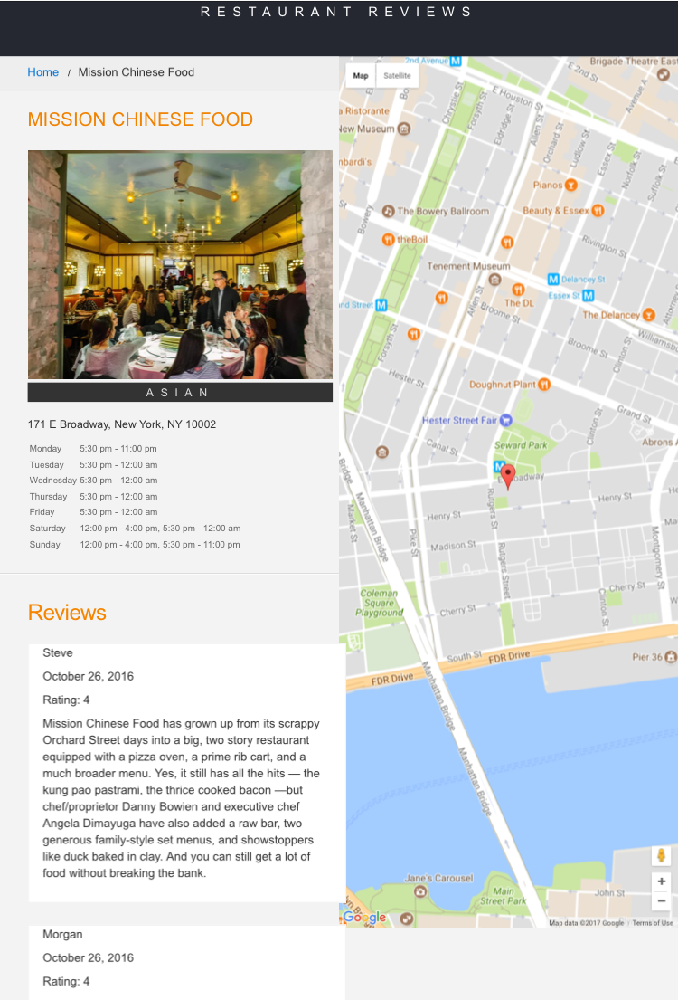

# Restaurant Reviews App

## Project Overview:

This project was developed as part of the Udacity Front End Web Developer Nanodegree. For the **Restaurant Reviews App** projects, I converted a static webpage to a mobile-ready web application. I took a static design that lacks accessibility and converted the design to be responsive on different sized displays and accessible for screen reader use. I also added a service worker to begin the process of creating a seamless offline experience for users.

Starter code was provided by Udacity for a restaurant reviews website. The code had a lot of issues. It’s barely usable on a desktop browser, much less a mobile device. It also doesn’t include any standard accessibility features, and it doesn’t work offline at all. I updated the code to resolve these issues while still maintaining the included functionality.

## Requirements Implemented
Made the provided site fully responsive. All of the page elements were updated to be usable and visible in any viewport, including desktop, tablet, and mobile displays. Images were organized so that they do not overlap, and page elements wrap when the viewport is too small to display them side by side.

I converted a site that looks like this:

...into a site that looks like this:

## Made the site accessible
Web accessibility was implemented. All alt attributes were added and descriptions for images were added. Added screen-reader-only attributes when appropriate to add useful supplementary text. Used semantic markup where possible, and aria attributes when semantic markup is not feasible.

## Cache the static site for offline use. 
Using Cache API and a ServiceWorker, cached the data for the website so that any page (including images) that has been visited is accessible offline.

## Steps to run the code

1. In the main folder, start a simple HTTP server to serve up the site files on your local computer. In a terminal, check the version of Python you have: `python -V`. If you have Python 2.x, spin up the server with `python -m SimpleHTTPServer 8000` (or some other port, if port 8000 is already in use.) For Python 3.x, you can use `python3 -m http.server 8000`. If you don't have Python installed, navigate to Python's [website](https://www.python.org/) to download and install the software.

2. With your server running, visit the site: `http://localhost:8000`

## Leaflet.js and Mapbox:

This repository uses [leafletjs](https://leafletjs.com/) with [Mapbox](https://www.mapbox.com/). You need to replace `<your MAPBOX API KEY HERE>` with a token from [Mapbox](https://www.mapbox.com/). Mapbox is free to use, and does not require any payment information. 

## Note about ES6

Most of the code in this project has been written to the ES6 JavaScript specification for compatibility with modern web browsers and future proofing JavaScript code. As much as possible, try to maintain use of ES6 in any additional JavaScript you write. 

